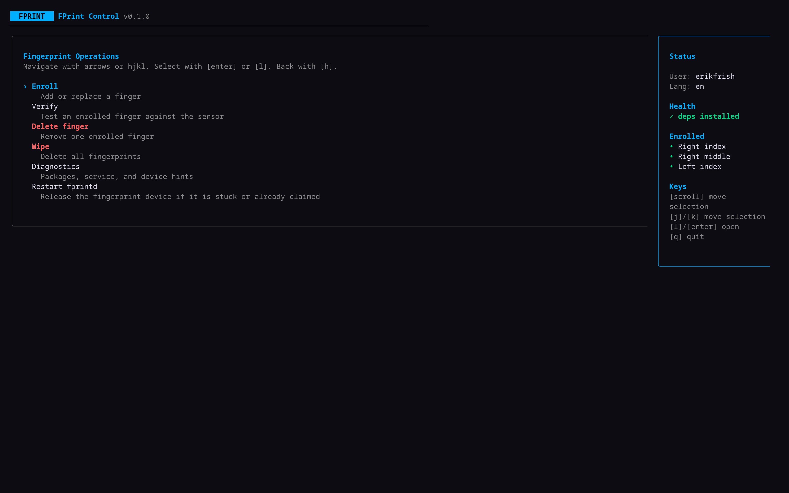
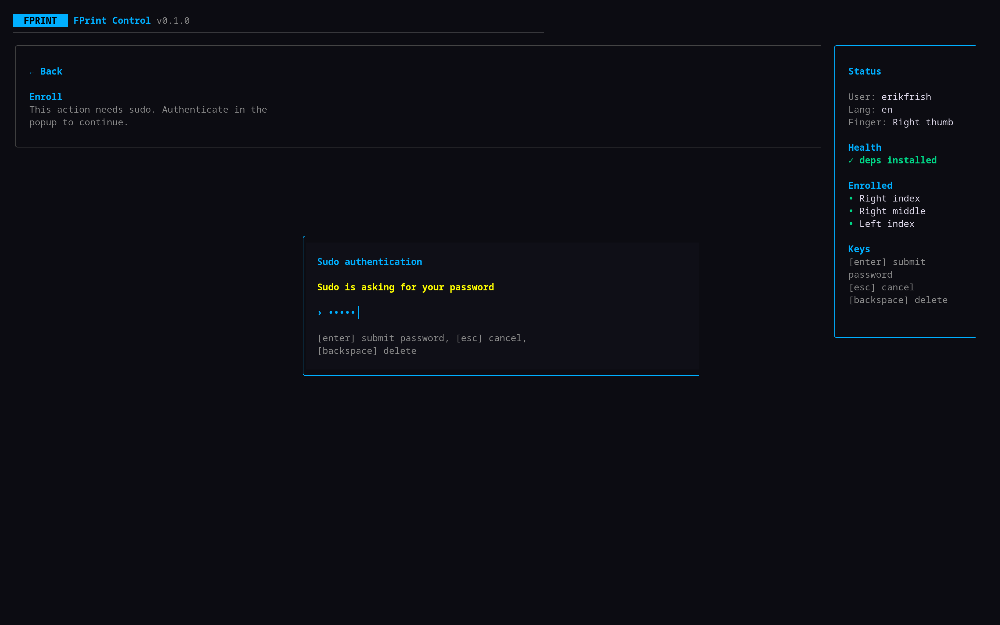
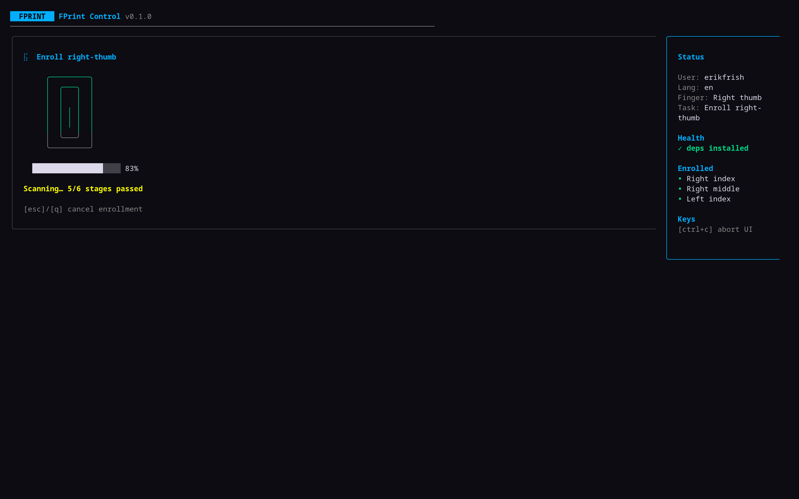

# FPrint Control

A terminal UI for Linux fingerprint management powered by `fprintd`.

Translations: [English](README.md), [Русский](docs/README.ru.md), [简体中文](docs/README.zh-CN.md)

FPrint Control is designed for desktop launchers and terminal workflows. It lets
you inspect enrolled fingerprints, enroll a new one, verify the sensor, delete a
single slot, wipe local users, restart `fprintd`, and run basic diagnostics
without leaving the menu.

## Screenshots







## Features

- Keyboard-first Bubble Tea interface
- Colorful overview, confirmation, running, and result screens
- Two-panel layout with a persistent status sidebar
- Minimum terminal size guard shows a resize warning instead of broken layout
- Vertical mouse/touchpad scrolling moves selection; clicks and horizontal scroll are ignored
- Sidebar shows package health and currently enrolled fingerprints
- Verify and delete flows only show fingerprints that are already enrolled
- Built-in sudo/PAM authentication popup for privileged actions
- Password-only enrollment authentication keeps the fingerprint reader clean for scanning
- Enrollment progress, retry feedback, duplicate detection, and success screen
- SQLite-backed English/Russian/Simplified Chinese localization selected from `LANG` or `--lang`
- Keyboard navigation works on English and Russian layouts
- Installs missing `fprintd`/`libfprint` packages with the detected package manager when requested
- Destructive actions require confirmation and recover from busy `fprintd` device claims
- Diagnostics for packages, `fprintd.service`, and likely USB fingerprint devices

## Install

```bash
go install github.com/erikfrish/fprint-menu@latest
```

Local build:

```bash
go build -o fprint-menu .
./fprint-menu
```

## Requirements

- `fprintd`
- `libfprint`
- One of `pacman`, `dnf`, `apt-get`, or `nix-env` for dependency detection/install prompts
- Optional: `usbutils` for richer device diagnostics

Run as your normal desktop user. Do not launch the whole app with `sudo`; the TUI
requests privilege only when an action needs it.

## Usage

```bash
fprint-menu
fprint-menu --lang ru
fprint-menu --lang zh
fprint-menu --log debug
fprint-menu --help
```

Navigation works with arrow keys, `hjkl`, and matching Russian-layout physical
keys. `q` quits outside modal inputs; `esc` goes back or cancels the current
modal/action.

Enrollment intentionally asks for a password instead of sudo fingerprint auth.
This avoids using the fingerprint reader for authentication immediately before
`fprintd-enroll`, which can otherwise leave the reader in a stale state and make
enrollment start at the wrong stage.

Logging is disabled by default. Use `--log debug` to write debug traces to
`/tmp/fprint-menu.log` when diagnosing sudo/PAM or `fprintd` behavior.

## Compatibility

Tested on 2026-05-15:

- Host Arch Linux: `gofmt`, `go test ./...`, `go build ./...`, `go vet ./...`, `go install`, `--help`, `--version`, `--lang ru`, `--lang en`.
- Hardware: ThinkPad T14p Gen 3.
- Fedora Toolbox distrobox: installed `golang`, `git`, `fprintd`, `fprintd-pam`, `libfprint`; `go build`, `go vet`, `--help`, `--version`, `--lang ru` passed.
- Ubuntu 24.04 distrobox: installed `golang-go`, `git`, `fprintd`, `libpam-fprintd`, `libfprint-2-2`; `go build`, `go vet`, `--help`, `--version`, `--lang ru` passed.
- Nix container: `nixos/nix` is not distrobox-compatible because it lacks `/etc/os-release`, so it was tested directly with `podman` and `nix-shell -p go git`; `go build`, `go vet`, `--help`, `--version`, `--lang ru` passed.

Runtime package mapping:

- Arch: `fprintd`, `libfprint`
- Fedora: `fprintd`, `fprintd-pam`, `libfprint`
- Ubuntu: `fprintd`, `libpam-fprintd`, `libfprint-2-2`
- Nix: `nixpkgs.fprintd`, `nixpkgs.libfprint`
